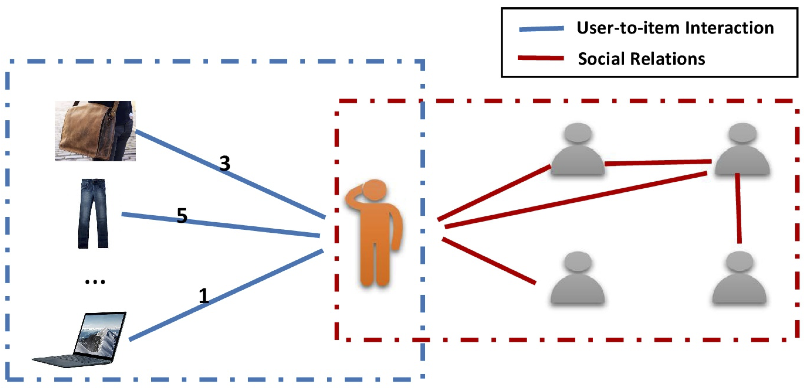

# Social_network_recommender

## Abstract
Graph Neural Networks (GNNs) have shown remarkable potential in advancing social recommendation systems by leveraging their ability to integrate node information and topological structure. In this project:

- Encoding both interactions and associated opinions in the user-item graph
- Handling heterogeneous strengths of social relations
- Modeling users across two graphs (user-user social graph and user-item graph)

## Introduction
Social recommendation systems typically involve two types of graphs:

- User-Item Graph (left)
- User-User Social Graph (right)

The user-item graph uniquely encodes not just interactions but also users' opinions (or rating scores) on items, represented by the numbers on the edges.

## Model Architecture
Three major components:

- User Modeling: Learns latent factors of users by processing both the user-item and user-user social graphs.
  1. Item Aggregation: Understands users through their interactions with items.
  2. Social Aggregation: Models users from the social perspective.
- Item Modeling: Learns latent factors of items by aggregating users' opinions in the user-item graph.
- Rating Prediction: Integrates user and item modeling to learn model parameters.

